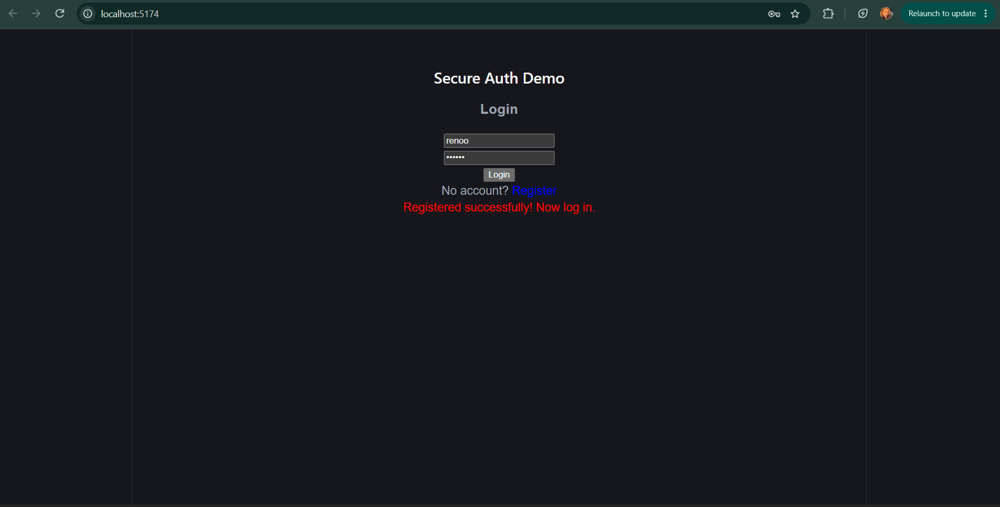
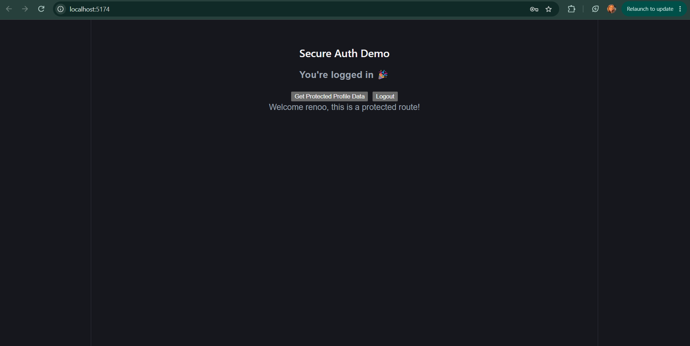

# Secure User Authentication — AVIP Task 1

A full stack authentication system built with React (frontend) and Node.js/Express (backend), featuring registration, login, hashed passwords, JWT-based sessions, and a protected route.

## Tech Stack

- Frontend: React (Vite)
- Backend: Node.js, Express
- Auth: bcrypt (password hashing), jsonwebtoken (JWT)

## Features

- User registration with input validation
- Passwords hashed with bcrypt before storage (never stored in plain text)
- Login with credential verification and JWT token issuance
- Protected endpoint accessible only with a valid token
- Proper HTTP status codes for success/error cases

## API Endpoints

| Endpoint    | Method | Auth Required | Description                                  |
|-------------|--------|----------------|-----------------------------------------------|
| `/`         | GET    | No             | Health check                                  |
| `/register` | POST   | No             | Register a new user                           |
| `/login`    | POST   | No             | Log in and receive a JWT token                |
| `/profile`  | GET    | Yes (Bearer token) | Protected route, returns user info        |

### Example: Register
POST /register
Content-Type: application/json

{
"username": "raneem",
"password": "123456"
}

### Example: Login
POST /login
Content-Type: application/json

{
"username": "raneem",
"password": "123456"
}

Response:
```json
{
  "message": "Login successful",
  "token": "eyJhbGciOiJIUzI1NiIs..."
}
```

### Example: Authenticated Request
GET /profile
Authorization: Bearer <token>


Response:
```json
{
  "message": "Welcome raneem, this is a protected route!"
}
```

## Running Locally

### Backend
cd backend
npm install
cp .env.example .env # then fill in your own JWT_SECRET
node server.js

Runs on `http://localhost:5000`

### Frontend
cd frontend
npm install
npm run dev

Runs on `http://localhost:5173`

## Demo

See screenshots below showing the full flow: register → login → access protected route.



## Live Demo

- Frontend: https://wd-1-secure-auth-byte.vercel.app
- Backend API: https://wd1secureauthbyte-production.up.railway.app